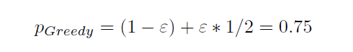
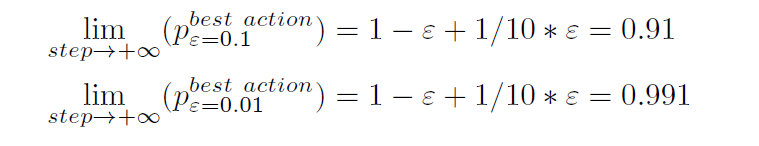
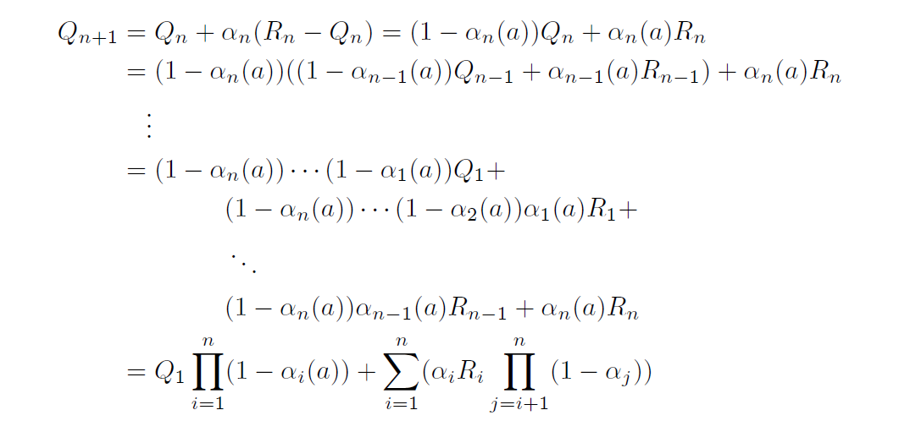

## Selected Reference Solution For Chapter 2

#### `Exercise 2.1`
> 

#### `Exercise 2.2`
> Definitely occured: time step 2 and 5; might occur:time step 1, 3 and 4;

#### `Exercise 2.3`
> epsilon = 0.01 will perform better in long run.
> 

#### `Exercise 2.4`
> 

#### `Exercise 2.7`
> 

#### `Exercise 2.8`
> Case A or B unknown, best expectation = 0.5; behave randomly will achieve
> Case A or B known, best expectation = 0.55; For case A, choose action 2; whereas case B, choose action 1;

---

## Experiments Results For Chapter 2

### Bandit Problem

__Average Rewards For Different methods__

__Optimal Actions For Different methods__

