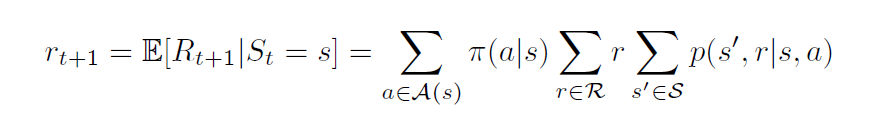
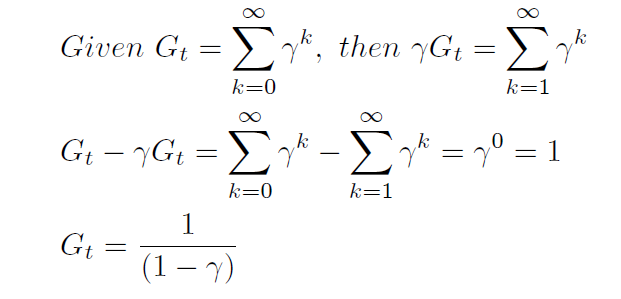
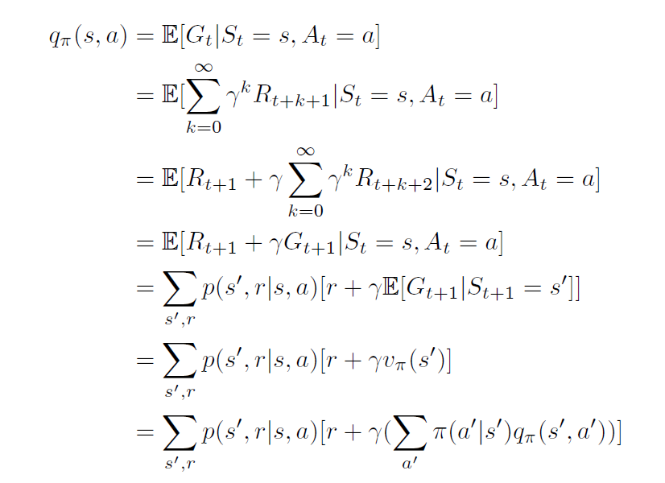
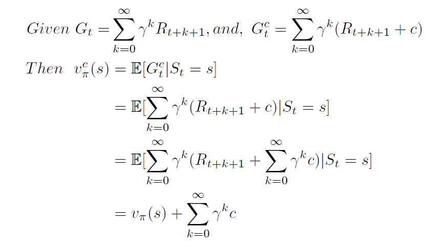
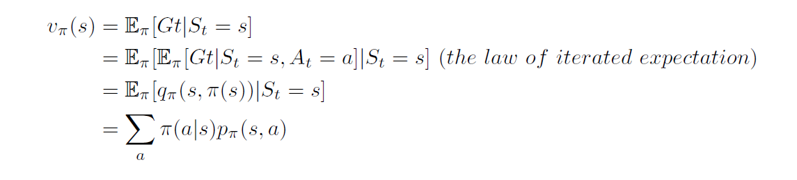
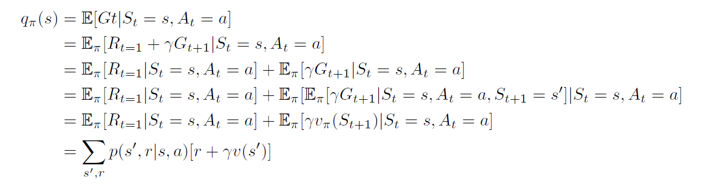
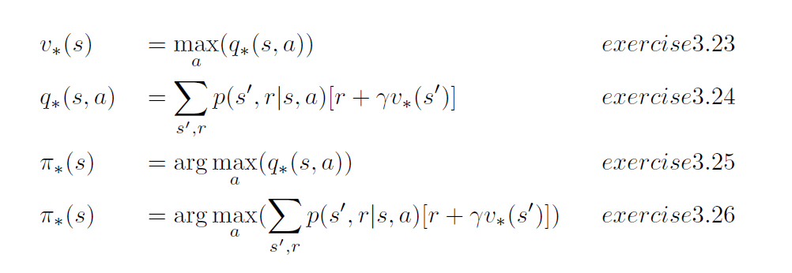

## Selected Reference Solution For Chapter 3

`Exercise 3.4`
> 

`Exercise 3.5`

 |s |a |s'|r |p(s',r / s,a)|
 |:------|:------|:------|:------|:------|
 |high |search  |high |r_search | alpha    |
 |high |search  |low  |r_search | 1 - alpha|
 |low  |search  |high |r_search | 0        |
 |low  |search  |high |-3       | 1 - beta |
 |low  |search  |low  |r_search | beta     |
 |high |wait    |high |r_wait   | 1        |
 |high |wait    |low  |r_wait   | 0        |
 |low  |wait    |high |r_wait   | 0        |
 |low  |wait    |low  |r_wait   | 1        |
 |low  |recharge|high |0        | 1        |
 |low  |recharge|low  |r_rechar | 0        |

`Exercise 3.6`
> 

`Exercise 3.7`
> The return at each time step is still (-1 * gamma ^ K).
> For episodic pole-balance, 'K' will be reset to 0 after each failure, where continuing task won't but increase whatever.

`Exercise 3.9`
> G5 = 0
> G4 = R5 + 0.5*G5 = 2        
> G3 = R4 + 0.5*G4 = 3 + 1 = 4       
> G2 = R3 + 0.5*G3 = 6 + 2 = 8    
> G1 = R2 + 0.5*G2 = 2 + 4 = 6    
> G0 = R1 + 0.5*G1 = -1 + 3 = 2     

`Exercise 3.10`
> G1 = 7 / (1-0.9) = 70     
> G0 = R1 + 0.9*G1 = 2 + 63 = 65    

`Exercise 3.11`
> 

`Exercise 3.13`
> 

`Exercise 3.14`
> 

`Exercise 3.16`
> 

`Exercise 3.17`
> 

`Exercise 3.21`
> v*(A) = 10 + v*(A') = 10 + 0.9*(0 + 0.9 v*(1, 3)) = .... = 10 + 0.9^5 v*(A)    
> v*(A) = 10 / (1 - 0.9^5)

`Exercise 3.22`
> 

`Exercise 3.23,24,25,26`
> 

---

## Experiments Results For Chapter 3

### Grid World

`WorldSize = 5, discount = 0.9, Optimal Policy`

||||||
|:-----:|:-----:|:-----:|:-----:|:-----:|
|  21.98|  24.42|  21.98|  19.42|  17.48|
|  19.78|  21.98|  19.78|  17.80|  16.02|
|  17.80|  19.78|  17.80|  16.02|  14.42|
|  16.02|  17.80|  16.02|  14.42|  12.98|
|  14.42|  16.02|  14.42|  12.98|  11.68|

`State Value _Converge Process_ Using Optimal Policy`

#### _Iteration 1 time_
||||||
|:-----:|:-----:|:-----:|:-----:|:-----:|
|   0.00|  10.00|   0.00|   5.00|   0.00|
|   0.00|   0.00|   0.00|   0.00|   0.00|
|   0.00|   0.00|   0.00|   0.00|   0.00|
|   0.00|   0.00|   0.00|   0.00|   0.00|
|   0.00|   0.00|   0.00|   0.00|   0.00|

#### _Iteration 10 times_
||||||
|:-----:|:-----:|:-----:|:-----:|:-----:|
|  14.31|  15.90|  14.31|  13.24|  11.65|
|  12.88|  14.31|  12.88|  11.65|  10.44|
|  11.59|  12.88|  11.59|  10.44|   8.24|
|  10.44|  11.59|  10.44|   8.24|   7.15|
|   5.90|  10.44|   5.90|   7.15|   5.10|

#### _Iteration 20 times_
||||||
|:-----:|:-----:|:-----:|:-----:|:-----:|
|  19.31|  21.45|  19.31|  16.99|  15.29|
|  17.37|  19.31|  17.37|  15.64|  14.07|
|  15.64|  17.37|  15.64|  14.07|  11.99|
|  14.07|  15.64|  14.07|  11.99|  10.79|
|  11.45|  14.07|  11.45|  10.79|   9.27|

#### _Iteration 50 times_
||||||
|:-----:|:-----:|:-----:|:-----:|:-----:|
|  21.86|  24.29|  21.86|  19.29|  17.36|
|  19.68|  21.86|  19.68|  17.71|  15.94|
|  17.71|  19.68|  17.71|  15.94|  14.29|
|  15.94|  17.71|  15.94|  14.29|  12.86|
|  14.29|  15.94|  14.29|  12.86|  11.58|

#### _Iteration 80 times_
||||||
|:-----:|:-----:|:-----:|:-----:|:-----:|
|  21.97|  24.41|  21.97|  19.41|  17.47|
|  19.78|  21.97|  19.78|  17.80|  16.02|
|  17.80|  19.78|  17.80|  16.02|  14.41|
|  16.02|  17.80|  16.02|  14.41|  12.97|
|  14.41|  16.02|  14.41|  12.97|  11.68|

#### _Iteration 100 times_
||||||
|:-----:|:-----:|:-----:|:-----:|:-----:|
|  21.98|  24.42|  21.98|  19.42|  17.48|
|  19.78|  21.98|  19.78|  17.80|  16.02|
|  17.80|  19.78|  17.80|  16.02|  14.42|
|  16.02|  17.80|  16.02|  14.42|  12.98|
|  14.42|  16.02|  14.42|  12.98|  11.68|
