## Selected Reference Solution For Chapter 4

`Exercise 4.1`
> 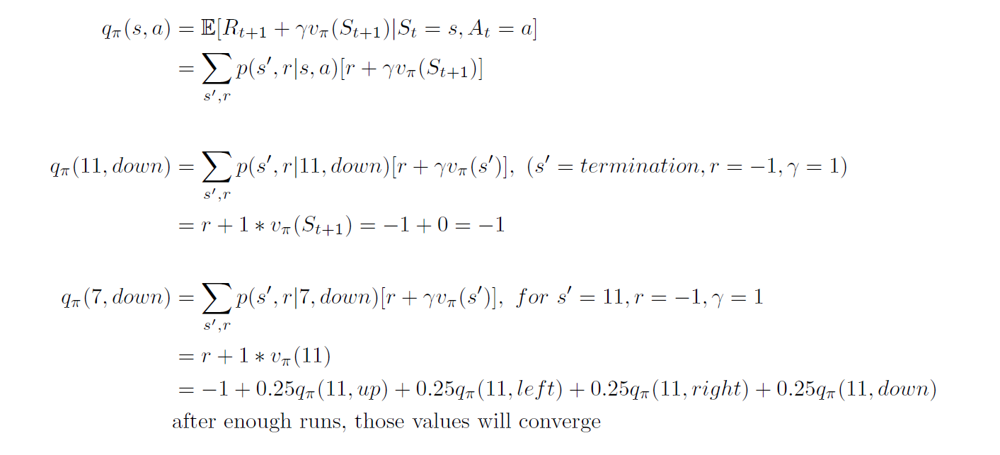

`Exercise 4.2`
> As long as the dynamics of original states unchanged, the new added state 15 won't affect their state values.    
> The sate value of v(15) can be easily cacludated by Bellman equation.
> When state 13 can transite to 15, all state values need be re-calculated by policy evaluation.

`Exercise 4.3`
> 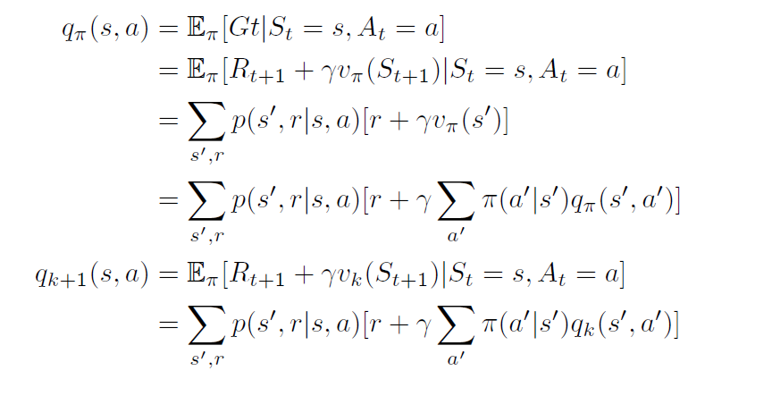

`Exercise 4.4`
> 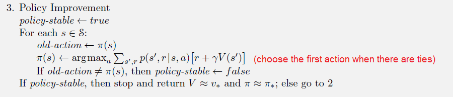

`Exercise 4.6`
> 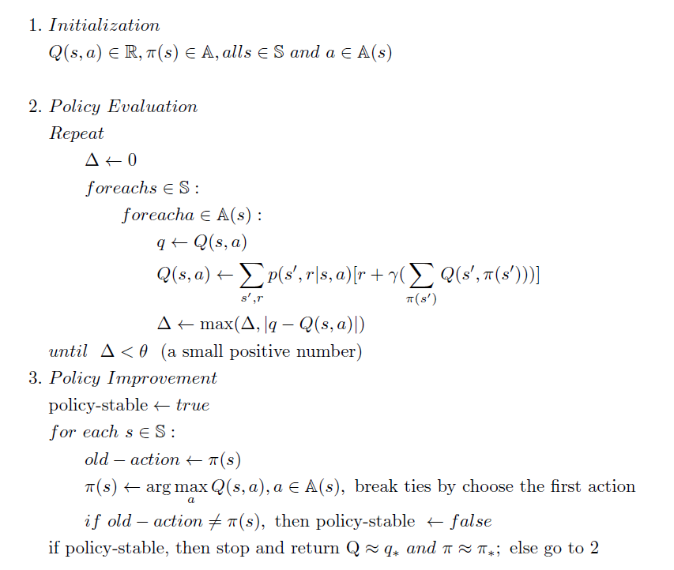

`Exercise 4.8`
> 

---

## Experiments Results For Chapter 4

### 1. Car Rental

__Car Rental__
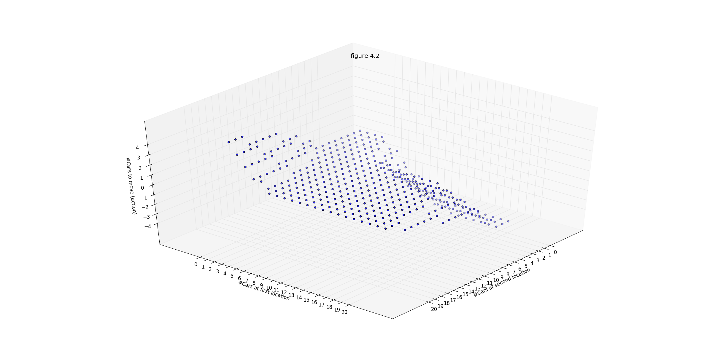

__Car Rental Policy__

First/second| 0|1|2|3|4|5|6|7|8|9|10|11|12|13|14|15|16|17|18|19|20|
|:-----:|:-----:|:-----:|:-----:|:-----:|:-----:|:-----:|:-----:|:-----:|:-----:|:-----:|:-----:|:-----:|:-----:|:-----:|:-----:|:-----:|:-----:|:-----:|:-----:|:-----:|:-----:|
0|      0|      0|      0|      0|      0|      0|      0|      0|     -1|     -1|     -2|     -2|     -2|     -3|     -3|     -3|     -3|     -3|     -4|     -4|     -4||
1|      0|      0|      0|      0|      0|      0|      0|      0|      0|     -1|     -1|     -1|     -2|     -2|     -2|     -2|     -2|     -3|     -3|     -3|     -3||
2|      0|      0|      0|      0|      0|      0|      0|      0|      0|      0|      0|     -1|     -1|     -1|     -1|     -1|     -2|     -2|     -2|     -2|     -2||
3|      0|      0|      0|      0|      0|      0|      0|      0|      0|      0|      0|      0|      0|      0|      0|     -1|     -1|     -1|     -1|     -1|     -1||
4|      1|      0|      0|      0|      0|      0|      0|      0|      0|      0|      0|      0|      0|      0|      0|      0|      0|      0|      0|      0|     -1||
5|      1|      1|      1|      0|      0|      0|      0|      0|      0|      0|      0|      0|      0|      0|      0|      0|      0|      0|      0|      0|      0||
6|      2|      2|      1|      1|      1|      0|      0|      0|      0|      0|      0|      0|      0|      0|      0|      0|      0|      0|      0|      0|      0||
7|      3|      2|      2|      2|      1|      1|      0|      0|      0|      0|      0|      0|      0|      0|      0|      0|      0|      0|      0|      0|      0||
8|      3|      3|      3|      2|      2|      1|      0|      0|      0|      0|      0|      0|      0|      0|      0|      0|      0|      0|      0|      0|      0||
9|      4|      4|      3|      3|      2|      1|      0|      0|      0|      0|      0|      0|      0|      0|      0|      0|      0|      0|      0|      0|      0||
10|      5|      4|      4|      3|      2|      1|      1|      0|      0|      0|      0|      0|      0|      0|      0|      0|      0|      0|      0|      0|      0||
11|      5|      5|      4|      3|      2|      2|      1|      0|      0|      0|      0|      0|      0|      0|      0|      0|      0|      0|      0|      0|      0||
12|      5|      5|      4|      3|      3|      2|      1|      0|      0|      0|      0|      0|      0|      0|      0|      0|      0|      0|      0|      0|      0||
13|      5|      5|      4|      4|      3|      2|      1|      0|      0|      0|      0|      0|      0|      0|      0|      0|      0|      0|      0|      0|      0||
14|      5|      5|      5|      4|      3|      2|      1|      0|      0|      0|      0|      0|      0|      0|      0|      0|      0|      0|      0|      0|      0||
15|      5|      5|      5|      4|      3|      2|      1|      0|      0|      0|      0|      0|      0|      0|      0|      0|      0|      0|      0|      0|      0||
16|      5|      5|      5|      4|      3|      2|      1|      0|      0|      0|      0|      0|      0|      0|      0|      0|      0|      0|      0|      0|      0||
17|      5|      5|      5|      4|      3|      2|      1|      1|      0|      0|      0|      0|      0|      0|      0|      0|      0|      0|      0|      0|      0||
18|      5|      5|      5|      4|      3|      2|      2|      1|      0|      0|      0|      0|      0|      0|      0|      0|      0|      0|      0|      0|      0||
19|      5|      5|      5|      4|      3|      3|      2|      1|      1|      1|      1|      1|      1|      0|      0|      0|      0|      0|      0|      0|      0||
20|      5|      5|      5|      4|      4|      3|      2|      2|      2|      2|      2|      2|      1|      1|      1|      1|      1|      1|      0|      0|      0||

__Car Rental State Values__
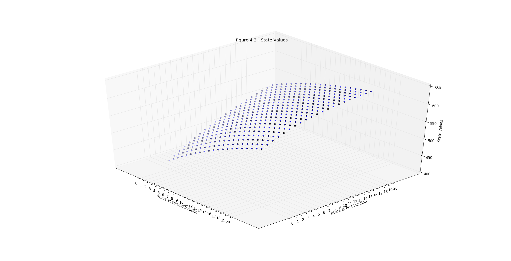

|First/second| 0|1|2|3|4|5|6|7|8|9|10|11|12|13|14|15|16|17|18|19|20|
|:-----:|:-----:|:-----:|:-----:|:-----:|:-----:|:-----:|:-----:|:-----:|:-----:|:-----:|:-----:|:-----:|:-----:|:-----:|:-----:|:-----:|:-----:|:-----:|:-----:|:-----:|:-----:|
0| 420.90| 430.86| 440.71| 450.33| 459.60| 468.45| 476.86| 484.82| 492.66| 500.20| 507.54| 514.68| 521.43| 527.89| 534.25| 540.27| 545.98| 551.39| 556.64| 561.73| 566.56||
1| 430.74| 440.69| 450.54| 460.16| 469.44| 478.29| 486.69| 494.66| 502.20| 509.54| 516.67| 523.42| 529.89| 536.25| 542.27| 547.98| 553.39| 558.64| 563.72| 568.56| 573.15||
2| 440.13| 450.09| 459.93| 469.55| 478.82| 487.66| 496.05| 504.00| 511.54| 518.67| 525.42| 531.88| 538.24| 544.27| 549.97| 555.38| 560.63| 565.72| 570.55| 575.15| 579.52||
3| 448.82| 458.77| 468.62| 478.22| 487.47| 496.28| 504.64| 512.56| 520.06| 527.16| 533.88| 540.24| 546.26| 551.97| 557.38| 562.63| 567.72| 572.55| 577.15| 581.52| 585.60||
4| 456.78| 466.69| 476.53| 486.11| 495.31| 504.07| 512.37| 520.22| 527.65| 534.68| 541.34| 547.65| 553.61| 559.27| 564.63| 569.71| 574.54| 579.14| 583.51| 587.60| 591.42||
5| 464.70| 474.53| 484.11| 493.32| 502.46| 511.12| 519.32| 527.06| 534.38| 541.32| 547.88| 554.10| 559.98| 565.56| 570.84| 575.86| 580.62| 585.13| 589.42| 593.42| 596.95||
6| 472.54| 482.12| 491.32| 500.46| 509.13| 517.61| 525.66| 533.25| 540.43| 547.23| 553.67| 559.77| 565.54| 571.02| 576.21| 581.13| 585.80| 590.23| 594.43| 598.33| 601.78||
7| 480.12| 489.33| 498.47| 507.13| 515.61| 523.66| 531.54| 538.95| 545.96| 552.59| 558.88| 564.83| 570.48| 575.84| 580.92| 585.73| 590.30| 594.63| 598.73| 602.55| 605.91||
8| 487.33| 496.47| 505.14| 513.62| 521.67| 529.54| 537.06| 544.28| 551.09| 557.53| 563.65| 569.45| 574.95| 580.17| 585.12| 589.82| 594.27| 598.50| 602.50| 606.22| 609.49||
9| 494.47| 503.14| 511.62| 519.67| 527.55| 535.07| 542.28| 549.29| 555.90| 562.15| 568.08| 573.71| 579.06| 584.13| 588.95| 593.52| 597.85| 601.97| 605.86| 609.48| 612.66||
10| 501.15| 509.63| 517.67| 525.55| 533.07| 540.29| 547.30| 554.04| 560.44| 566.49| 572.24| 577.69| 582.87| 587.80| 592.47| 596.91| 601.12| 605.11| 608.90| 612.41| 615.51||
11| 507.63| 515.68| 523.56| 531.07| 538.29| 545.30| 552.04| 558.54| 564.74| 570.59| 576.15| 581.44| 586.45| 591.22| 595.75| 600.05| 604.14| 608.01| 611.68| 615.09| 618.10||
12| 513.68| 521.56| 529.08| 536.30| 543.30| 550.05| 556.55| 562.82| 568.81| 574.48| 579.86| 584.97| 589.82| 594.44| 598.82| 602.99| 606.95| 610.70| 614.26| 617.56| 620.47||
13| 519.39| 527.08| 534.30| 541.31| 548.05| 554.55| 560.82| 566.88| 572.68| 578.17| 583.37| 588.31| 593.01| 597.47| 601.71| 605.74| 609.57| 613.20| 616.64| 619.84| 622.66||
14| 524.80| 532.30| 539.31| 546.05| 552.55| 558.82| 564.88| 570.73| 576.36| 581.66| 586.69| 591.47| 596.01| 600.32| 604.42| 608.32| 612.01| 615.52| 618.85| 621.94| 624.66||
15| 529.95| 537.26| 544.06| 550.56| 556.83| 562.88| 568.73| 574.39| 579.84| 584.97| 589.83| 594.44| 598.83| 603.00| 606.95| 610.71| 614.28| 617.67| 620.88| 623.86| 626.49||
16| 534.83| 541.96| 548.56| 554.83| 560.89| 566.74| 572.39| 577.85| 583.13| 588.09| 592.78| 597.23| 601.46| 605.47| 609.29| 612.91| 616.35| 619.61| 622.71| 625.59| 628.12||
17| 539.48| 546.43| 552.84| 558.89| 564.74| 570.39| 575.86| 581.13| 586.24| 591.02| 595.53| 599.81| 603.88| 607.73| 611.40| 614.88| 618.19| 621.34| 624.32| 627.09| 629.54||
18| 543.90| 550.67| 556.90| 562.74| 568.40| 573.86| 579.14| 584.24| 589.03| 593.64| 597.98| 602.09| 605.99| 609.70| 613.22| 616.57| 619.75| 622.78| 625.65| 628.33| 630.69||
19| 548.09| 554.70| 560.75| 566.40| 571.86| 577.14| 582.24| 587.04| 591.64| 595.99| 600.10| 604.00| 607.70| 611.24| 614.64| 617.87| 620.95| 623.88| 626.66| 629.26| 631.55||
20| 552.07| 558.53| 564.41| 569.87| 575.15| 580.25| 585.04| 589.65| 593.99| 598.10| 602.00| 605.71| 609.24| 612.64| 615.87| 618.95| 621.88| 624.66| 627.33| 629.86| 632.11||

### Car Rental Exercise 4.5
__Car Rental__
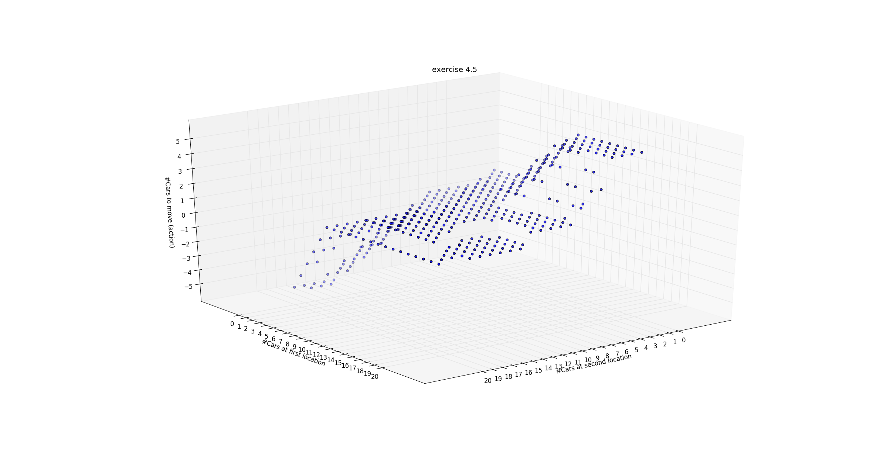

__Exercise 4.5 Policy__

|First/second| 0|1|2|3|4|5|6|7|8|9|10|11|12|13|14|15|16|17|18|19|20|
|:-----:|:-----:|:-----:|:-----:|:-----:|:-----:|:-----:|:-----:|:-----:|:-----:|:-----:|:-----:|:-----:|:-----:|:-----:|:-----:|:-----:|:-----:|:-----:|:-----:|:-----:|:-----:|
0|      0|      0|      0|      0|      0|      0|      0|     -1|     -1|     -2|     -2|     -3|     -3|     -3|     -4|     -4|     -5|     -5|     -5|     -5|     -5||
1|      1|      0|      0|      0|      0|      0|      0|      0|     -1|     -1|     -2|     -2|     -2|     -3|     -3|     -4|     -4|     -5|     -5|     -5|     -4||
2|      1|      1|      0|      0|      0|      0|      0|      0|      0|     -1|     -1|     -1|     -2|     -2|     -3|     -3|     -4|     -4|     -4|     -3|     -3||
3|      1|      1|      1|      1|      0|      0|      0|      0|      0|      0|      0|     -1|     -1|     -2|     -2|     -3|     -3|     -3|     -2|     -2|     -2||
4|      1|      1|      1|      1|      1|      0|      0|      0|      0|      0|      0|      0|     -1|     -1|     -2|     -2|     -2|     -1|     -1|     -1|     -1||
5|      1|      1|      1|      1|      1|      1|      1|      0|      0|      0|      0|      0|      0|     -1|     -1|     -1|      0|      0|      0|      0|      0||
6|      2|      1|      1|      1|      1|      1|      1|      1|      0|      0|      0|      0|      0|      0|      0|      0|      0|      0|      0|      0|      0||
7|      2|      2|      1|      1|      1|      1|      1|      1|      1|      0|      0|      0|      0|      0|      0|      0|      0|      0|      0|      0|      0||
8|      3|      2|      2|      1|      1|      1|      1|      1|      1|      1|      0|      0|      0|      0|      0|      0|      0|      0|      0|      0|      0||
9|      3|      3|      2|      2|      1|      1|      1|      1|      1|      1|      1|      1|      0|      0|      1|      1|      1|      1|      1|      1|      0||
10|      4|      3|      3|      2|      2|      2|      1|      1|      1|      1|      1|      1|      1|      1|      1|      1|      1|      1|      1|      1|      0||
11|      4|      4|      3|      3|      3|      2|      2|      2|      1|      1|      1|      1|      1|      1|      1|      1|      1|      1|      1|      1|      0||
12|      5|      4|      4|      4|      3|      3|      3|      2|      1|      1|      1|      1|      1|      1|      1|      1|      1|      1|      1|      1|      0||
13|      5|      5|      5|      4|      4|      4|      3|      2|      1|      1|      1|      1|      1|      1|      1|      1|      1|      1|      1|      1|      0||
14|      5|      5|      5|      5|      5|      4|      3|      2|      1|      1|      1|      1|      1|      1|      1|      1|      1|      1|      1|      1|      0||
15|      5|      5|      5|      5|      5|      4|      3|      1|      1|      1|      1|      1|      0|      0|      0|      1|      1|      1|      1|      1|      0||
16|      5|      5|      5|      5|      5|      4|      2|      1|      1|      1|      1|      0|      0|      0|      0|      0|      1|      1|      1|      1|      0||
17|      5|      5|      5|      5|      5|      3|      2|      1|      1|      1|      1|      0|      0|      0|      0|      0|      0|      0|      1|      1|      0||
18|      5|      5|      5|      5|      4|      3|      1|      1|      1|      1|      1|      0|      0|      0|      0|      0|      0|      0|      0|      1|      0||
19|      5|      5|      5|      5|      4|      2|      2|      1|      1|      1|      1|      0|      0|      0|      0|      0|      0|      0|      0|      0|      0||
20|      5|      5|      5|      5|      3|      3|      2|      1|      1|      1|      1|      1|      0|      0|      0|      0|      0|      0|      1|      1|      0||

__Exercise 4.5 State Values__
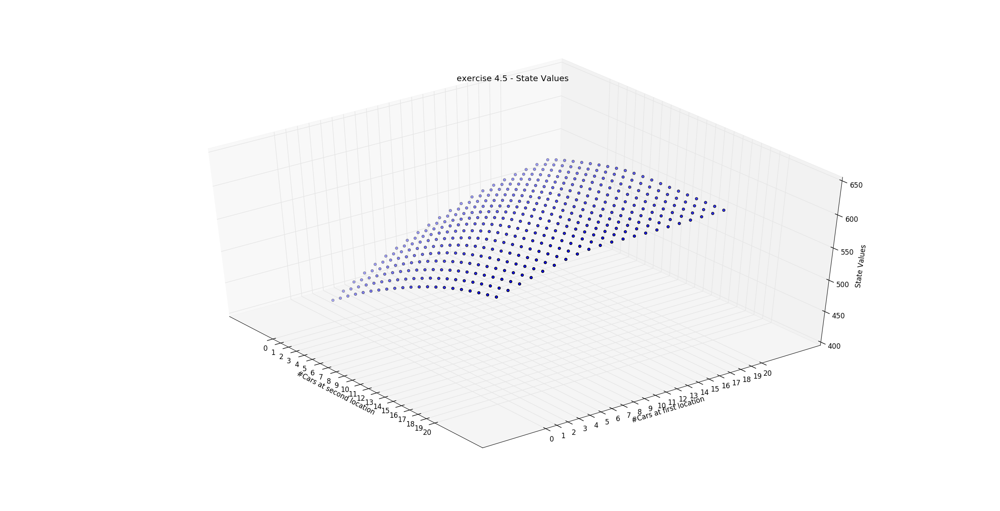

|First/second| 0|1|2|3|4|5|6|7|8|9|10|11|12|13|14|15|16|17|18|19|20|
|:-----:|:-----:|:-----:|:-----:|:-----:|:-----:|:-----:|:-----:|:-----:|:-----:|:-----:|:-----:|:-----:|:-----:|:-----:|:-----:|:-----:|:-----:|:-----:|:-----:|:-----:|:-----:|
0| 430.02| 439.97| 449.79| 459.32| 468.46| 477.13| 485.33| 493.20| 500.92| 508.40| 515.65| 522.41| 529.07| 535.06| 540.79| 545.89| 550.60| 554.80| 558.49| 561.86| 565.02||
1| 439.97| 449.86| 459.67| 469.21| 478.34| 487.00| 495.19| 502.92| 510.39| 517.64| 524.40| 531.07| 537.05| 542.79| 547.88| 552.60| 556.80| 560.50| 563.94| 567.05| 570.01||
2| 449.86| 459.67| 469.24| 478.77| 487.89| 496.53| 504.69| 512.39| 519.64| 526.40| 533.06| 539.05| 544.79| 549.88| 554.60| 558.80| 562.49| 565.93| 569.05| 572.01| 574.83||
3| 459.43| 469.24| 478.77| 487.89| 496.89| 505.49| 513.59| 521.22| 528.39| 535.06| 541.05| 546.78| 551.88| 556.59| 560.79| 564.49| 567.93| 571.05| 574.00| 576.83| 579.49||
4| 468.46| 478.27| 487.79| 496.89| 505.49| 513.74| 521.76| 529.29| 536.36| 542.91| 548.78| 553.87| 558.59| 562.79| 566.49| 569.93| 573.04| 576.00| 578.82| 581.48| 583.95||
5| 476.82| 486.63| 496.13| 505.19| 513.74| 521.76| 529.29| 536.64| 543.57| 549.97| 555.67| 560.58| 564.78| 568.48| 571.92| 575.04| 577.99| 580.82| 583.48| 585.94| 588.11||
6| 484.63| 494.30| 503.79| 512.82| 521.30| 529.23| 536.64| 543.57| 550.12| 556.33| 561.83| 566.52| 570.48| 573.92| 577.03| 579.95| 582.71| 585.32| 587.80| 590.09| 592.10||
7| 492.30| 501.79| 510.86| 519.83| 528.24| 536.07| 543.35| 550.12| 556.33| 562.06| 567.32| 571.75| 575.44| 578.60| 581.44| 584.10| 586.62| 589.03| 591.30| 593.41| 595.25||
8| 499.80| 508.86| 517.84| 526.34| 534.65| 542.34| 549.47| 556.06| 562.06| 567.32| 571.97| 576.11| 579.50| 582.36| 584.92| 587.32| 589.61| 591.80| 593.88| 595.80| 597.46||
9| 506.86| 515.84| 524.34| 532.65| 540.38| 547.91| 554.84| 561.21| 566.98| 571.97| 576.11| 579.50| 582.48| 585.04| 587.32| 589.61| 591.80| 593.88| 595.80| 597.46| 598.56||
10| 513.85| 522.35| 530.65| 538.38| 545.91| 552.84| 559.27| 565.38| 570.87| 575.57| 579.41| 582.48| 585.04| 587.31| 589.45| 591.51| 593.49| 595.38| 597.10| 598.56| 598.75||
11| 520.35| 528.66| 536.39| 543.91| 550.84| 557.28| 563.39| 568.88| 573.86| 578.25| 581.76| 584.52| 586.77| 588.77| 590.65| 592.48| 594.26| 595.95| 597.48| 598.75| 598.46||
12| 526.66| 534.39| 541.92| 548.85| 555.28| 561.39| 566.88| 571.87| 576.31| 580.36| 583.56| 586.01| 587.97| 589.70| 591.33| 592.94| 594.52| 596.02| 597.37| 598.46| 598.08||
13| 532.39| 539.92| 546.85| 553.28| 559.40| 564.88| 569.87| 574.32| 578.53| 582.26| 585.14| 587.31| 589.00| 590.47| 591.87| 593.27| 594.65| 595.96| 597.14| 598.08| 597.82||
14| 537.29| 544.60| 551.29| 557.40| 562.89| 567.88| 572.32| 576.54| 580.66| 584.09| 586.70| 588.61| 590.06| 591.30| 592.48| 593.66| 594.85| 595.99| 597.01| 597.82| 597.75||
15| 541.48| 548.52| 554.91| 560.71| 565.88| 570.33| 574.54| 578.82| 582.73| 585.91| 588.29| 589.97| 591.38| 592.44| 593.29| 594.21| 595.21| 596.18| 597.05| 597.75| 597.85||
16| 545.25| 552.00| 558.05| 563.51| 568.33| 572.54| 576.82| 581.02| 584.72| 587.70| 589.88| 591.45| 592.78| 593.69| 594.39| 595.04| 595.72| 596.52| 597.25| 597.85| 598.09||
17| 548.83| 555.26| 560.97| 566.07| 570.55| 574.83| 579.03| 583.10| 586.62| 589.43| 591.45| 592.95| 594.14| 594.91| 595.47| 595.98| 596.48| 597.00| 597.58| 598.09| 598.41||
18| 552.23| 558.36| 563.74| 568.51| 572.83| 577.03| 581.11| 585.05| 588.42| 591.08| 592.95| 594.30| 595.36| 596.00| 596.44| 596.83| 597.22| 597.61| 598.02| 598.41| 598.74||
19| 555.39| 561.25| 566.34| 570.84| 575.04| 579.11| 583.05| 586.80| 590.04| 592.57| 594.30| 595.38| 596.33| 596.86| 597.21| 597.50| 597.80| 598.11| 598.43| 598.74| 599.03||
20| 558.27| 563.91| 568.77| 573.04| 577.12| 581.06| 584.81| 588.22| 591.34| 593.75| 595.38| 596.33| 597.00| 597.45| 597.72| 597.95| 598.19| 598.44| 598.74| 599.03| 599.23||

----

__Exercise 4.9 Gambler Problem__

#### head probability = 0.4

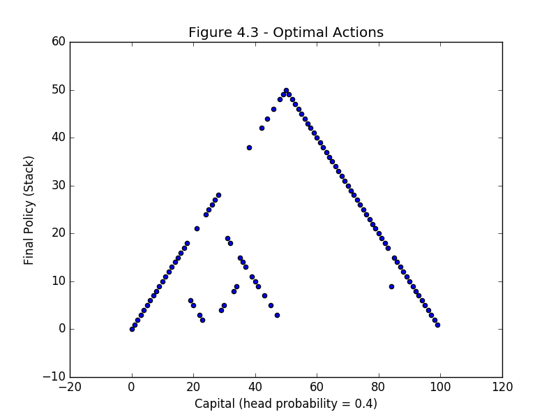

#### head probability = 0.25

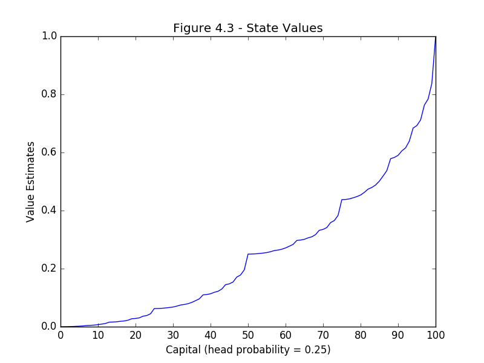
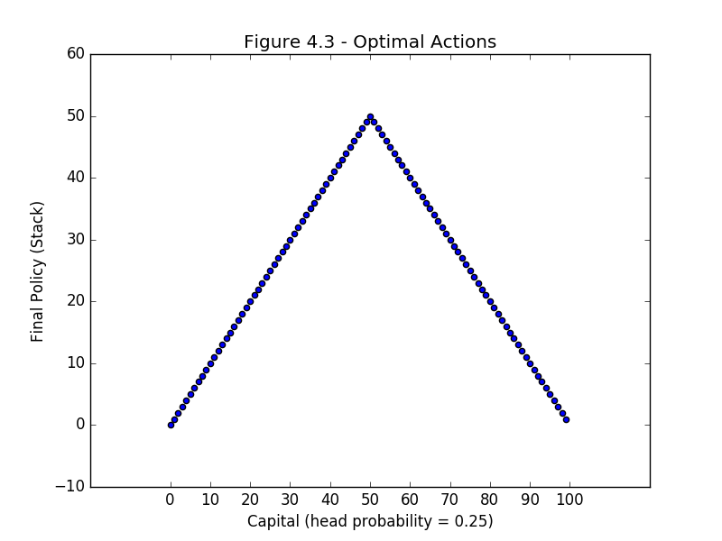

#### head probability = 0.55

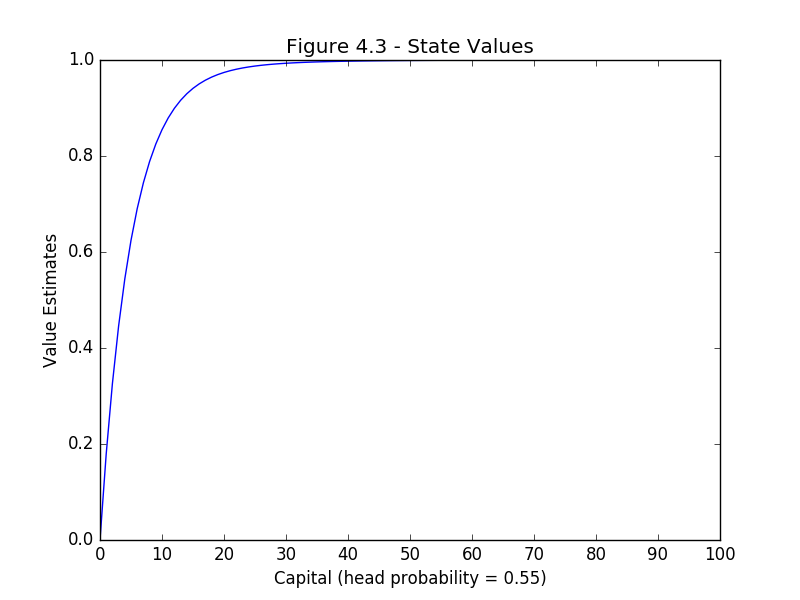
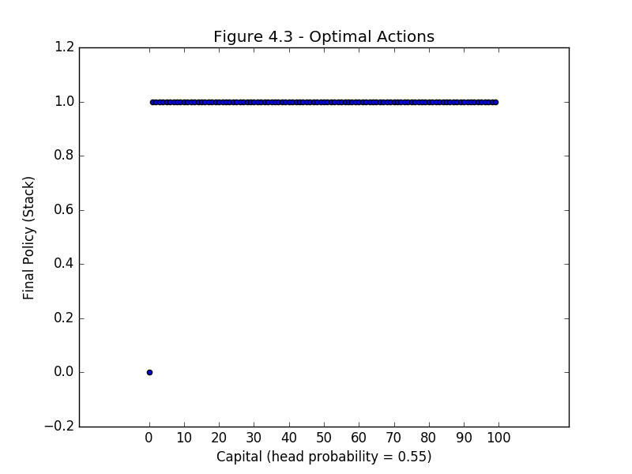
