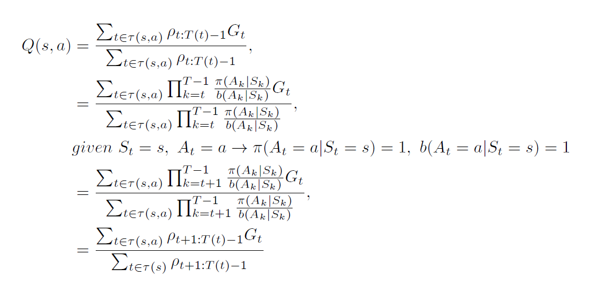
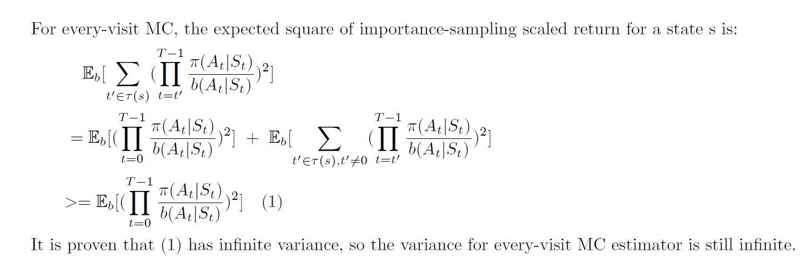
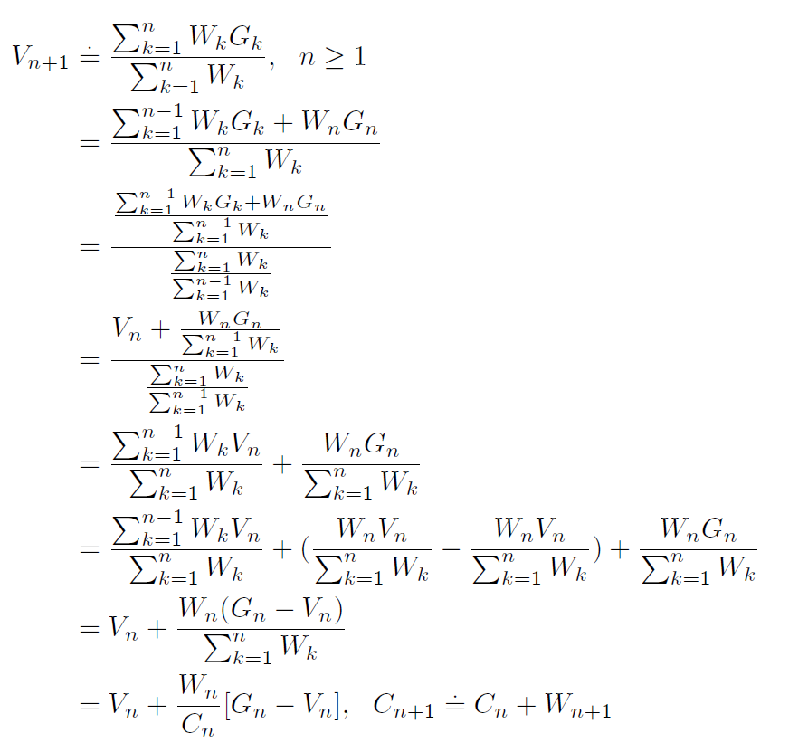

```
Exercise 5.3 What is the backup diagram for Monte Carlo estimation of q ?
```
> 

```
Exercise 5.4 The pseudocode for Monte Carlo ES is inefficient because, for each state–
action pair, it maintains a list of all returns and repeatedly calculates their mean. It would
be more efficient to use techniques similar to those explained in Section 2.4 to maintain
just the mean and a count (for each state–action pair) and update them incrementally.
Describe how the pseudocode would be altered to achieve this.
```
> Weighted importance-sampling has bias towards Vb and Vb is a random policy, so its error increases for the initial episodes.

```
Exercise 5.5 Consider an MDP with a single nonterminal state and a single action
that transitions back to the nonterminal state with probability p and transitions to the
terminal state with probability 1 p. Let the reward be +1 on all transitions, and let
= 1. Suppose you observe one episode that lasts 10 steps, with a return of 10. What
are the first-visit and every-visit estimators of the value of the nonterminal state?
```
> 

```
Exercise 5.10 Derive the weighted-average update rule (5.8) from (5.7). Follow the
pattern of the derivation of the unweighted rule (2.3).
```
> 
