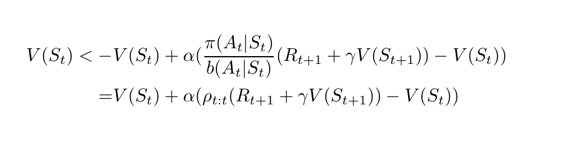

```
Exercise 6.1 If V changes during the episode, then (6.6) only holds approximately; what
would the di↵erence be between the two sides? Let V t denote the array of state values
used at time t in the TD error (6.5) and in the TD update (6.2). Redo the derivation
above to determine the additional amount that must be added to the sum of TD errors
in order to equal the Monte Carlo error
```
> 

```
Exercise 6.3 From the results shown in the left graph of the random walk example it
appears that the first episode results in a change in only V (A). What does this tell you
about what happened on the first episode? Why was only the estimate for this one state
changed? By exactly how much was it changed?

-----

1 .The first episode ends in left Terminal State.
2. Prediction using TD(0) and after one episode (with termination in Left), all states other than A are either not visited or visited but updated with TD error equals to 0. So their values are not changing.
3. For state A: V(t+1)(A) <- Vt(A) + alpha (R(t+1) + gamma * V(t+1)(T) - V(t)(A)) = alpha (1 - Vt(A))
```

----

```
Exercise 6.7 Design an off-policy version of the TD(0) update that can be used with arbitrary target policy and covering behavior policy b, using at each step t the importance sampling ratio  \rho_t:t (5.3).
```
> 


